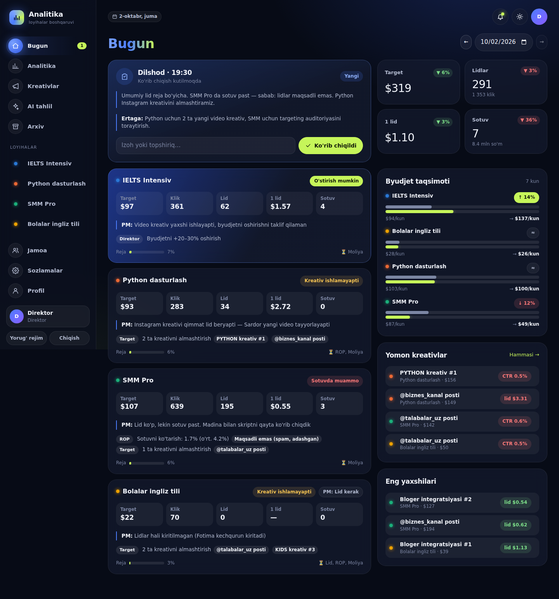
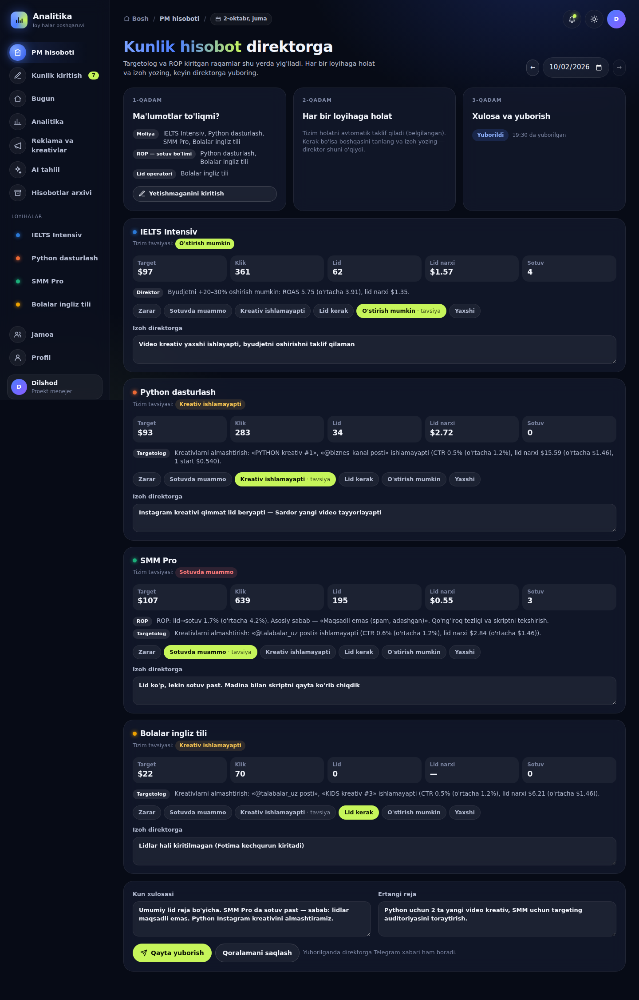
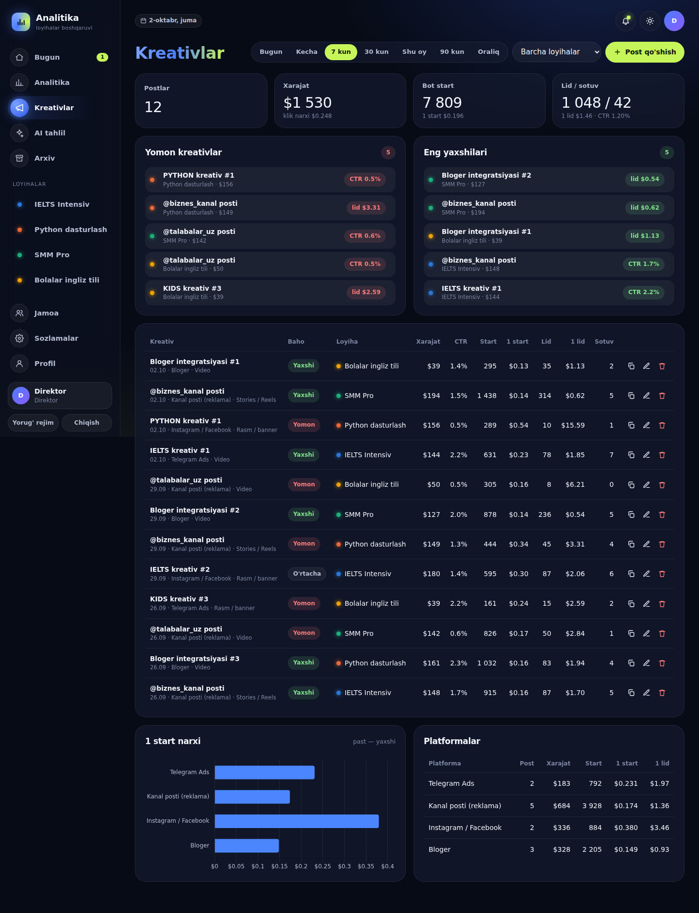

# Loyihalar analitikasi

Loyihalar direktori har kuni proekt menejerdan bitta tushunarli hisobot oladigan platforma. Hisobotda bugun qaysi loyihaga targetga qancha sarflangani, nechta klik va lid boʻlgani, qaysi loyiha oqsoqlanayotgani, qayerga koʻproq lid kerakligi va qaysi kreativ ishlamayotgani koʻrinadi.



## Kim ishlatadi

Dasturda bitta foydalanuvchi bor: **proekt menejer (PM)**. Targetolog va ROP tizimga kirmaydi — PM raqamlarni ulardan oladi va oʻzi kiritadi. Direktor hisobotni Telegramda oladi.

## Kunlik ish: 4 qadam

PM kirganda «Bugun» sahifasi ochiladi va qaysi qadamda turgani yuqorida koʻrinadi. Har bir qadamda bitta ish va bitta tugma bor.

1. **Target.** Targetologdan har bir loyiha boʻyicha xarajat ($) va kliklarni oling va jadvalga yozing. Kulrang raqam — kechagi qiymat, Enter — keyingi qator.
2. **Sotuv.** ROP dan lidlar, sotuvlar va tushumni oling va yozing.
3. **Tekshirish.** Tizim har bir loyihaga holat beradi (*Yaxshi, Oʻstirish mumkin, Lid kerak, Kreativ ishlamayapti, Sotuvda muammo, Zarar*), uni oddiy soʻz bilan tushuntiradi va birinchi qilinadigan ishni koʻrsatadi. Kerak boʻlsa holatni oʻzgartirib, izoh yozasiz.
4. **Yuborish.** Bir-ikki gap xulosa va ertangi reja yozasiz, direktorga boradigan xabarni oʻsha yerning oʻzida koʻrasiz va **«Direktorga yuborish»**ni bosasiz.

Har qadamni «Oʻtkazib yuborish» mumkin. Belgilangan vaqtgacha hisobot yuborilmasa, PM ga Telegramda eslatma boradi; avto-hisobot vaqtigacha ham yuborilmasa, direktorga «PM hisobotni yubormadi» belgisi bilan avtomatik hisobot ketadi.

Menyu:

| Boʻlim | Nima uchun |
|---|---|
| Bugun | 4 qadamli kunlik hisobot |
| Hisobotlar | oldingi kunlar; istalgan kunni ochib tuzatish mumkin |
| Loyihalar | davr boʻyicha raqamlar, voronka, grafiklar; loyiha sahifalari |
| Kreativlar | reklama postlari: qaysi kreativ ishlayapti, qaysi yoʻq |
| Sozlamalar | loyihalar, Telegram (hisobot qayerga boradi, eslatma vaqti), oylik reja, import/zaxira |

### Tavsiyalar qanday hisoblanadi (soʻnggi 7 kun)
- **Zarar:** ROAS < 1 boʻlsa, byudjetni qisqartirish taklif qilinadi.
- **Sotuvda muammo:** lid→sotuv oʻrtachaning 60% idan past boʻlsa. ROP ga asosiy rad sababi bilan vazifa beriladi.
- **Kreativ ishlamayapti:** quyidagilardan biri boʻlsa — kreativning CTR i oʻrtachaning 65% idan past, lid narxi 1.5 baravardan qimmat, $20 dan koʻp sarflanib lid yoʻq, yoki loyihaning lid narxi 1.4 baravardan qimmat.
- **Lid kerak:** oylik lid rejasidan orqada boʻlsa (kuniga qancha lid kerakligi hisoblanadi) yoki lidlar 15% dan koʻp kamaygan boʻlsa.
- **Oʻstirish mumkin:** ROAS oʻrtachadan 1.3 baravar yuqori va konversiya yaxshi boʻlsa.
- **Byudjet taqsimoti:** hozirgi ulush × (loyiha ROAS i / oʻrtacha ROAS). Koeffitsient 0.5 dan 1.6 gacha cheklanadi.

## Imkoniyatlar

### Voronka va analitika
- **Voronka:** reklama xarajati ($) → kliklar → bot /start (reklama + **organik**) → lidlar → sotuvlar → tushum → qayta sotuv (LTV).
- **Organik oqim** = bot startlar − reklama kliklari (1000 klik va 2500 start boʻlsa, 1500 tasi organik).
- **Koʻrsatkichlar:** 1 start narxi, klik narxi, lid narxi, mijoz narxi (CAC), oʻrtacha chek, LTV, ROAS, ROI, foyda, kassaga tushgan pul.
- Har bir koʻrsatkich oldingi shunday davr bilan solishtiriladi. KPI kartalarida mini-grafik bor.
- **Loyihalarni taqqoslash:** jadvalni istalgan ustun boʻyicha saralash mumkin. Qatorni bosganda loyiha sahifasi ochiladi.
- **Loyiha sahifasi:** bitta kurs boʻyicha voronka, reja, grafiklar, kunma-kun jadval, reklama postlari va izohlar.
- **Grafiklar:** 35 kundan uzun davrda maʼlumot avtomatik haftalarga jamlanadi.
- **CSV eksport:** Excel toʻgʻri ochadi.

### Oylik reja (KPI)
- Rahbar har bir loyiha uchun oylik maqsad qoʻyadi: byudjet, lid, sotuv, tushum.
- Bosh panelda bajarilish foizi, bugungacha kutilgan ulush (chiziqdagi belgi) va **oy oxirigacha prognoz** koʻrinadi.
- Holatlar: «Reja boʻyicha», «Xavf ostida», «Orqada». Byudjet uchun: «Tez sarflanyapti».
- Rejadan orqada qolgan loyiha avtomatik ogohlantirishga tushadi va Telegram hisobotida chiqadi.
- «Oʻtgan oydan nusxa» tugmasi bor.

### Reklama postlari
- Targetolog har bir post yoki kampaniyani alohida kiritadi: platforma, xarajat, kliklar.
- Har bir post uchun **alohida bot havolasi** beriladi: `t.me/<bot>?start=ielts__kanal_1`. Shu havola orqali kelgan startlar avtomatik postga yoziladi.
- Har bir post va platforma uchun 1 start, 1 lid va 1 sotuv narxi hisoblanadi. Qaysi kanal yoki bloger arzonroq odam olib kelayotgani koʻrinadi.

### «Nega lid koʻp, sotuv past?»
- Menejerlar har kuni sotib olmaslik sabablarini kiritadi: qimmat, javob bermadi, oʻylab koʻradi, maqsadli emas va boshqalar.
- Har bir rol izoh qoldiradi.
- Avtomatik ogohlantirishlar chiqadi: konversiya oʻrtachadan past, ROAS < 1, lid narxi oshdi, sifatli lidlar kam, lid oʻsdi-yu sotuv oʻsmadi.

### Maʼlumotlar tarixi
- Har bir oʻzgarish tarixga yoziladi: kim, qachon, eski va yangi qiymat.
- Bazada boshqa rollar (targetolog, ROP, moliya) ham saqlanadi, lekin interfeys faqat PM uchun.

### Telegram
- Bot `/start <loyiha>__<post>` deep linklarini sanaydi. Bitta odam kuniga bir marta hisoblanadi.
- Bot loyiha kanaliga **admin** qilib qoʻshilsa, kanalga qoʻshilgan va chiqib ketganlarni sanaydi.
- **Kunlik hisobot** belgilangan vaqtda guruhga boradi: voronka, loyihalar, oylik reja, ogohlantirishlar, kim kiritmagani. Xohlasangiz AI tahlil ham qoʻshiladi. Hisobot qanday koʻrinishini Sozlamalarda oldindan koʻrish mumkin.
- Hisobot yuborilmagan boʻlsa, PM ga shaxsiy **eslatma** boradi (Sozlamalar → Telegram da PM oʻz Telegram ID sini yozadi).
- **Telegram Mini App:** `APP_URL` berilsa, bot menyusida «Hisobot» tugmasi paydo boʻladi. Menejer platformani Telegram ichida ochadi va login-parolsiz kiradi: Telegram imzosi tekshiriladi, Telegram ID xodim profiliga bogʻlangan boʻlishi kerak.
- Bot buyruqlari: `/app`, `/hisobot`, `/kecha`, `/id`.
- Loyihaning oʻz boti boʻlsa, u hodisalarni `POST /api/track` orqali yuboradi (pastda).

### AI tahlil (Claude)
- Tanlangan davr va loyiha boʻyicha toʻliq tahlil beradi: qisqa xulosa, loyihalar, muammolar va sabablar, tavsiyalar (kim, nima qiladi).
- Tayyor savollar bor: «Byudjetni qaysi loyihaga oshirish kerak?», «Rejani bajarish uchun kim nima qilishi kerak?» va boshqalar. Erkin savol ham berish mumkin.
- Tahlillar tarixda saqlanadi.

### Boshqa
- Tungi va yorugʻ rejim. Telegram ichida Telegram mavzusiga moslashadi.
- Telefonga moslashgan: pastki menyu bor.
- Har bir xodim oʻz parolini oʻzgartira oladi.





## Ishga tushirish (lokal)

Node.js **22.5+** kerak. Maʼlumotlar bazasi Node ichidagi SQLite, alohida baza oʻrnatish shart emas.

```bash
cd analytika
npm install
cp .env.example .env      # kalitlarni yozing
npm run demo              # (ixtiyoriy) 45 kunlik namuna: 4 loyiha, postlar, oylik reja
npm start                 # http://localhost:3000
npm test                  # testlar
```

Namuna maʼlumot bilan kirish: login `pm`, parol `demo1234`.
Haqiqiy ishga tushirishda `npm run demo` ni bajarmang. Birinchi ishga tushganda admin paroli konsolga chiqadi yoki `ADMIN_PASSWORD` dan olinadi.

## Serverga joylash

### Docker (eng oson)
```bash
cp .env.example .env      # ANTHROPIC_API_KEY, TELEGRAM_BOT_TOKEN, APP_URL, ADMIN_PASSWORD
docker compose up -d      # ma'lumotlar ./data papkasida saqlanadi
```

### Oddiy VPS (Ubuntu)
1. Node 22 ni oʻrnating va kodni `/opt/analytika` ga joylang, keyin `npm ci --omit=dev`.
2. `deploy/analytika.service` → systemd orqali avtomatik ishga tushadi.
3. `deploy/nginx.conf` → domen va HTTPS (`certbot --nginx`). Telegram Mini App uchun HTTPS majburiy.
4. `.env` ga `COOKIE_SECURE=1` va `APP_URL=https://sizning-domen` yozing.
5. `deploy/backup.sh` → bazaning kunlik zaxira nusxasi (cron).

### Sozlash tartibi
1. **Sozlamalar → Loyihalar:** har bir kurs yoki loyihani qoʻshing.
2. **Sozlamalar → Oylik reja:** har bir loyiha uchun maqsad kiriting.
3. **Sozlamalar → Telegram:** direktor botga `/id` yozadi — chiqqan raqamni birinchi maydonga yozing. Oʻzingiz ham `/id` yozib, ikkinchi maydonga kiriting (eslatmalar uchun). Eslatma va avto-hisobot vaqtini belgilang.
4. **Kreativlar:** PM har bir reklama postini qoʻshadi va bergan havolani postga qoʻyadi.

## Tracking API

```http
POST /api/track
Content-Type: application/json

{"key": "<loyihaning tracking kaliti>", "event": "start", "tg_user_id": 123456, "source": "kanal_1"}
```

`event`: `start` · `lead` · `sale` · `join` · `leave`. Kalit **Sozlamalar → Loyihalar** boʻlimida.
- `source` post tegiga teng boʻlsa, natija shu postga yoziladi.
- Avtomatik sanalgan startlar qoʻlda kiritilganidan ustun turadi.
- Lid va sotuvlar esa qoʻlda kiritilmagan boʻlsagina avtomatik hisobdan olinadi.

## Brauzer demosi

`npm run build:demo` server kodini oʻzgartirmasdan bitta HTML faylga (`dist/demo.html`) yigʻadi. Unda server oʻrniga brauzer ichidagi xotira ishlaydi, hisob-kitob kodi esa oʻsha (`src/metrics.js`). claude.ai artifakt sifatida joylanganda AI tahlil va CSV yuklab olish ham ishlaydi.

## Tuzilishi

```
src/server.js      HTTP server, API, rejalashtiruvchi (hisobot/eslatma)
src/db.js          SQLite sxema, rollar, maydonlar, platformalar
src/metrics.js     voronka, konversiya, LTV/ROAS, o'sish, reja/prognoz, postlar, intizom, avto-xulosalar
src/extras.js      vazifalar, xarajat va sof foyda, signallar, haftalik hisobot, CSV import
src/reports.js     PM hisoboti: qoralama → yuborish → direktor ko'rib chiqadi, Telegram matni
src/auth.js        parollar, sessiyalar, Telegram Mini App imzosini tekshirish
src/ai.js          Claude orqali AI tahlil (ko'rsatma: ai-prompt.js)
src/telegram.js    bot: deep link, kanal a'zolari, hisobot, eslatma, Mini App menyusi
src/demo-data.js   namuna ma'lumotlar (server va brauzer demosi uchun)
public/js/         interfeys: core, today (direktor), report (PM, arxiv, jamoa), tasks, profit, dashboard, project, entry, campaigns, ai, settings
demo/              brauzer demosini yig'ish
deploy/            systemd, nginx, zaxira nusxa
test/              testlar — npm test
```

## Keyingi qadamlar (taklif)
- Facebook/Instagram Ads API: xarajat va kliklar avtomatik keladi, targetolog qoʻlda kiritmaydi.
- AmoCRM yoki Bitrix24 bilan ulash: lid va sotuvlar avtomatik tushadi.
- Payme/Click toʻlovlarini avtomatik hisobga olish (moliya uchun).
- Kogorta tahlili: qaysi oyda kelgan mijozlar keyin qancha qayta sotib oldi.
