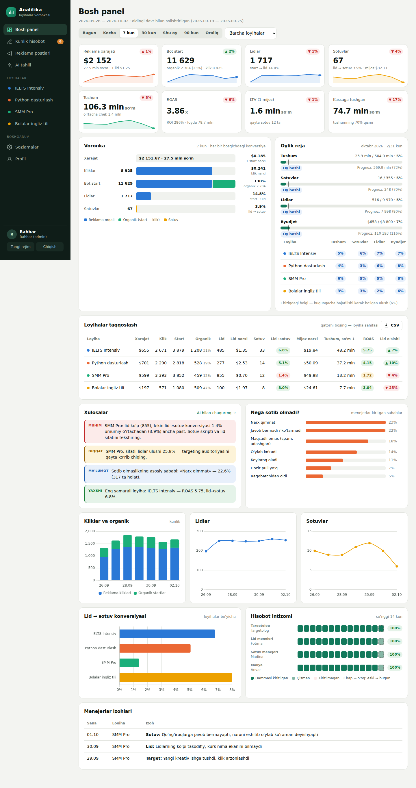
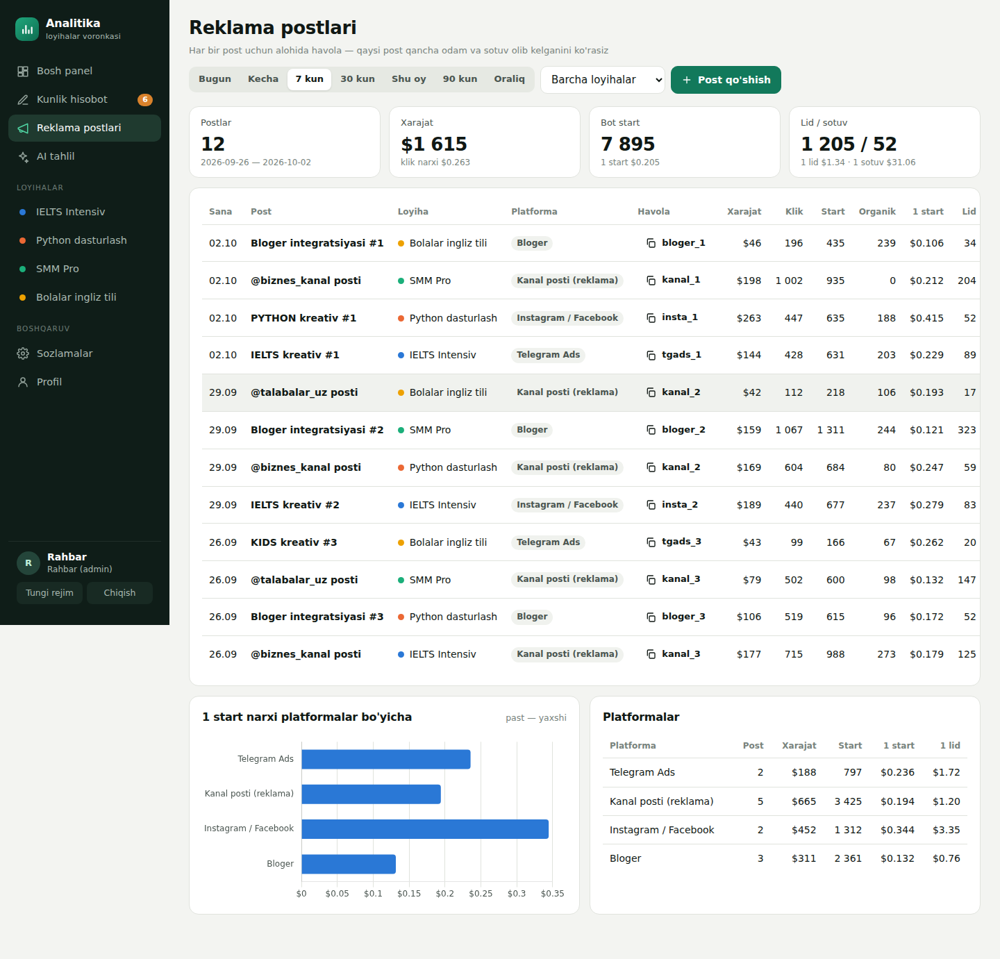

# Loyihalar analitikasi

Menejerlar har kuni raqam kiritadigan, barcha kurs va loyihalarning voronkasini bir joyda koʻrsatadigan va AI yordamida tahlil qiladigan platforma.

Topshiriq: «Ovozli xabarlar tahlili va loyiha texnik topshirigʻi» hujjati.



## Imkoniyatlar

### Voronka va analitika
- **Voronka:** reklama xarajati ($) → kliklar → bot /start (reklama + **organik**) → lidlar → sotuvlar → tushum → qayta sotuv (LTV).
- **Organik oqim** = bot startlar − reklama kliklari (1000 klik va 2500 start boʻlsa, 1500 tasi organik).
- **Koʻrsatkichlar:** 1 start narxi, klik narxi, lid narxi, mijoz narxi (CAC), oʻrtacha chek, LTV, ROAS, ROI, foyda, kassaga tushgan pul.
- Har bir koʻrsatkich oldingi shunday davr bilan solishtiriladi. KPI kartalarida mini-grafik bor.
- **Loyihalarni taqqoslash:** jadvalni istalgan ustun boʻyicha saralash mumkin. Qatorni bosganda loyiha sahifasi ochiladi.
- **Loyiha sahifasi:** bitta kurs boʻyicha voronka, reja, grafiklar, kunma-kun jadval, reklama postlari va izohlar.
- **Grafiklar:** 35 kundan uzun davrda maʼlumot avtomatik haftalarga jamlanadi.
- **CSV eksport:** Excel toʻgʻri ochadi.

### Oylik reja (KPI)
- Rahbar har bir loyiha uchun oylik maqsad qoʻyadi: byudjet, lid, sotuv, tushum.
- Bosh panelda bajarilish foizi, bugungacha kutilgan ulush (chiziqdagi belgi) va **oy oxirigacha prognoz** koʻrinadi.
- Holatlar: «Reja boʻyicha», «Xavf ostida», «Orqada». Byudjet uchun: «Tez sarflanyapti».
- Rejadan orqada qolgan loyiha avtomatik ogohlantirishga tushadi va Telegram hisobotida chiqadi.
- «Oʻtgan oydan nusxa» tugmasi bor.

### Reklama postlari
- Targetolog har bir post yoki kampaniyani alohida kiritadi: platforma, xarajat, kliklar.
- Har bir post uchun **alohida bot havolasi** beriladi: `t.me/<bot>?start=ielts__kanal_1`. Shu havola orqali kelgan startlar avtomatik postga yoziladi.
- Har bir post va platforma uchun 1 start, 1 lid va 1 sotuv narxi hisoblanadi. Qaysi kanal yoki bloger arzonroq odam olib kelayotgani koʻrinadi.

### «Nega lid koʻp, sotuv past?»
- Menejerlar har kuni sotib olmaslik sabablarini kiritadi: qimmat, javob bermadi, oʻylab koʻradi, maqsadli emas va boshqalar.
- Har bir rol izoh qoldiradi.
- Avtomatik ogohlantirishlar chiqadi: konversiya oʻrtachadan past, ROAS < 1, lid narxi oshdi, sifatli lidlar kam, lid oʻsdi-yu sotuv oʻsmadi.

### Rollar va intizom

| Rol | Kim | Nimani kiritadi |
|---|---|---|
| Targetolog | targetolog | xarajat ($), koʻrishlar, kliklar, reklama postlari |
| Lid menejeri | Fotima | bot startlar (qoʻlda), lidlar, sifatli lidlar, sotib olmaslik sabablari |
| Sotuv menejeri | Madina | sotuvlar soni, tushum, sabablar |
| Moliya | Anvar | kassaga tushgan pul, qayta sotuvlar (LTV) |
| Rahbar (admin) | — | hammasi, loyihalar, rejalar, xodimlar, sozlamalar |

- Har bir xodim faqat oʻz maydonlarini koʻradi va oʻzgartiradi.
- Kiritish sahifasida kechagi qiymat koʻrinadi, konversiyalar yozish paytida hisoblanadi.
- Har bir oʻzgarish tarixga yoziladi: kim, qachon, eski va yangi qiymat.
- **Hisobot intizomi:** soʻnggi 14 kunda kim raqamlarni oʻz vaqtida kiritgani har bir rol uchun kunlik katakchalarda koʻrinadi.
- Yon panelda bugun kiritilmagan hisobotlar soni chiqadi.

### Telegram
- Bot `/start <loyiha>__<post>` deep linklarini sanaydi. Bitta odam kuniga bir marta hisoblanadi.
- Bot loyiha kanaliga **admin** qilib qoʻshilsa, kanalga qoʻshilgan va chiqib ketganlarni sanaydi.
- **Kunlik hisobot** belgilangan vaqtda guruhga boradi: voronka, loyihalar, oylik reja, ogohlantirishlar, kim kiritmagani. Xohlasangiz AI tahlil ham qoʻshiladi. Hisobot qanday koʻrinishini Sozlamalarda oldindan koʻrish mumkin.
- Hisobot kiritmagan menejerlarga shaxsiy **eslatma** boradi.
- **Telegram Mini App:** `APP_URL` berilsa, bot menyusida «Hisobot» tugmasi paydo boʻladi. Menejer platformani Telegram ichida ochadi va login-parolsiz kiradi: Telegram imzosi tekshiriladi, Telegram ID xodim profiliga bogʻlangan boʻlishi kerak.
- Bot buyruqlari: `/app`, `/hisobot`, `/kecha`, `/id`.
- Loyihaning oʻz boti boʻlsa, u hodisalarni `POST /api/track` orqali yuboradi (pastda).

### AI tahlil (Claude)
- Tanlangan davr va loyiha boʻyicha toʻliq tahlil beradi: qisqa xulosa, loyihalar, muammolar va sabablar, tavsiyalar (kim, nima qiladi).
- Tayyor savollar bor: «Byudjetni qaysi loyihaga oshirish kerak?», «Rejani bajarish uchun kim nima qilishi kerak?» va boshqalar. Erkin savol ham berish mumkin.
- Tahlillar tarixda saqlanadi.

### Boshqa
- Tungi va yorugʻ rejim. Telegram ichida Telegram mavzusiga moslashadi.
- Telefonga moslashgan: pastki menyu bor.
- Har bir xodim oʻz parolini oʻzgartira oladi.



## Ishga tushirish (lokal)

Node.js **22.5+** kerak. Maʼlumotlar bazasi Node ichidagi SQLite, alohida baza oʻrnatish shart emas.

```bash
cd analytika
npm install
cp .env.example .env      # kalitlarni yozing
npm run demo              # (ixtiyoriy) 45 kunlik namuna: 4 loyiha, postlar, oylik reja
npm start                 # http://localhost:3000
npm test                  # testlar
```

Namuna maʼlumot bilan kirish uchun loginlar: `admin`, `target`, `fotima`, `madina`, `anvar`. Hammasining paroli `demo1234`.
Haqiqiy ishga tushirishda `npm run demo` ni bajarmang. Birinchi ishga tushganda admin paroli konsolga chiqadi yoki `ADMIN_PASSWORD` dan olinadi.

## Serverga joylash

### Docker (eng oson)
```bash
cp .env.example .env      # ANTHROPIC_API_KEY, TELEGRAM_BOT_TOKEN, APP_URL, ADMIN_PASSWORD
docker compose up -d      # ma'lumotlar ./data papkasida saqlanadi
```

### Oddiy VPS (Ubuntu)
1. Node 22 ni oʻrnating va kodni `/opt/analytika` ga joylang, keyin `npm ci --omit=dev`.
2. `deploy/analytika.service` → systemd orqali avtomatik ishga tushadi.
3. `deploy/nginx.conf` → domen va HTTPS (`certbot --nginx`). Telegram Mini App uchun HTTPS majburiy.
4. `.env` ga `COOKIE_SECURE=1` va `APP_URL=https://sizning-domen` yozing.
5. `deploy/backup.sh` → bazaning kunlik zaxira nusxasi (cron).

### Sozlash tartibi
1. **Sozlamalar → Loyihalar:** har bir kurs yoki loyihani qoʻshing.
2. **Sozlamalar → Oylik rejalar:** har bir loyiha uchun maqsad kiriting.
3. **Sozlamalar → Xodimlar:** Fotima, Madina, Anvar va targetologga login bering va rol tanlang. Telegram ID ni ham kiriting: xodim botga `/id` yozib bilib oladi.
4. **Telegram:** botni kanallarga admin qiling va kanal ID sini loyihaga kiriting. Hisobot boradigan guruh ID sini va vaqtni belgilang.
5. **Reklama:** targetolog «Reklama postlari» boʻlimida post qoʻshadi va bergan havolani postga qoʻyadi.

## Tracking API

```http
POST /api/track
Content-Type: application/json

{"key": "<loyihaning tracking kaliti>", "event": "start", "tg_user_id": 123456, "source": "kanal_1"}
```

`event`: `start` · `lead` · `sale` · `join` · `leave`. Kalit **Sozlamalar → Loyihalar** boʻlimida.
- `source` post tegiga teng boʻlsa, natija shu postga yoziladi.
- Avtomatik sanalgan startlar qoʻlda kiritilganidan ustun turadi.
- Lid va sotuvlar esa qoʻlda kiritilmagan boʻlsagina avtomatik hisobdan olinadi.

## Brauzer demosi

`npm run build:demo` server kodini oʻzgartirmasdan bitta HTML faylga (`dist/demo.html`) yigʻadi. Unda server oʻrniga brauzer ichidagi xotira ishlaydi, hisob-kitob kodi esa oʻsha (`src/metrics.js`). claude.ai artifakt sifatida joylanganda AI tahlil va CSV yuklab olish ham ishlaydi.

## Tuzilishi

```
src/server.js      HTTP server, API, rejalashtiruvchi (hisobot/eslatma)
src/db.js          SQLite sxema, rollar, maydonlar, platformalar
src/metrics.js     voronka, konversiya, LTV/ROAS, o'sish, reja/prognoz, postlar, intizom, avto-xulosalar
src/auth.js        parollar, sessiyalar, Telegram Mini App imzosini tekshirish
src/ai.js          Claude orqali AI tahlil (ko'rsatma: ai-prompt.js)
src/telegram.js    bot: deep link, kanal a'zolari, hisobot, eslatma, Mini App menyusi
src/demo-data.js   namuna ma'lumotlar (server va brauzer demosi uchun)
public/js/         interfeys: core, dashboard, project, entry, campaigns, ai, settings
demo/              brauzer demosini yig'ish
deploy/            systemd, nginx, zaxira nusxa
test/              testlar — npm test
```

## Keyingi qadamlar (taklif)
- Facebook/Instagram Ads API: xarajat va kliklar avtomatik keladi, targetolog qoʻlda kiritmaydi.
- AmoCRM yoki Bitrix24 bilan ulash: lid va sotuvlar avtomatik tushadi.
- Payme/Click toʻlovlarini avtomatik hisobga olish (moliya uchun).
- Kogorta tahlili: qaysi oyda kelgan mijozlar keyin qancha qayta sotib oldi.
