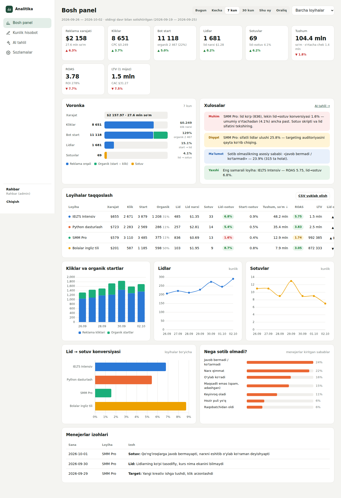

# Loyihalar analitikasi

Menejerlar har kuni raqamlarni kiritadigan, barcha kurs va loyihalarning voronkasini bir joyda koʻrsatadigan va AI yordamida tahlil qiladigan platforma.

Topshiriq: «Ovozli xabarlar tahlili va loyiha texnik topshirigʻi» hujjati.



## Nima qiladi

**Voronka (har bir loyiha uchun):**
reklama xarajati ($) → kliklar → bot /start (reklama + **organik**) → lidlar → sotuvlar → tushum → qayta sotuv (LTV).

- **Organik oqim** = bot startlar − reklama kliklari (masalan, 1000 klik va 2500 start boʻlsa, 1500 tasi organik).
- Konversiyalar: klik→start, start→lid, lid→sotuv, start→sotuv.
- Pul koʻrsatkichlari: CPC, lid narxi (CPL), mijoz narxi (CAC), oʻrtacha chek, LTV, ROAS, ROI.
- Har bir koʻrsatkich oldingi shunday davr bilan solishtiriladi (oʻsish tezligi).
- **Loyihalarni taqqoslash** jadvali: qaysi kurs tez oʻsyapti, qaysi biri pulni behuda sarflayapti.

**«Nega lid koʻp, sotuv past?» degan savolga javob beradi:**
- Menejerlar har kuni sotib olmaslik sabablarini kiritadi: qimmat, javob bermadi, oʻylab koʻradi, maqsadli emas va hokazo.
- Har bir rol izoh qoldiradi (masalan, «yangi kreativ ishga tushdi», «lidlar tasodifiy»).
- Avtomatik ogohlantirishlar chiqadi. Masalan: «SMM Pro: lid koʻp, lekin lid→sotuv 1.6% — oʻrtachadan ancha past», ROAS 1 dan past, CPL oshdi, sifatli lidlar kam.

**Rollar (hujjatdagi mas'ullar jadvaliga mos):**

| Rol | Kim | Nimani kiritadi |
|---|---|---|
| Targetolog | targetolog | xarajat ($), koʻrishlar, kliklar |
| Lid menejeri | Fotima | bot startlar (qoʻlda), lidlar, sifatli lidlar, sotib olmaslik sabablari |
| Sotuv menejeri | Madina | sotuvlar soni, tushum, sabablar |
| Moliya | Anvar | kassaga tushgan pul, qayta sotuvlar (LTV) |
| Rahbar (admin) | — | hammasi, loyihalar, xodimlar, sozlamalar |

Har bir xodim faqat oʻz maydonlarini oʻzgartira oladi. Har bir oʻzgarish tarixga yoziladi: kim, qachon, eski va yangi qiymat.
Kunlik roʻyxatda bugun kim hisobot kiritmagani koʻrinib turadi.

**Telegram integratsiyasi:**
- Reklama postlarida `t.me/<bot>?start=<loyiha>` havolasi ishlatiladi. Bot kim qaysi loyihadan /start bosganini avtomatik sanaydi. Bitta odam kuniga bir marta hisoblanadi.
- Manbani ajratish uchun: `?start=ielts__post12`.
- Bot loyiha kanaliga **admin** qilib qoʻshiladi va kanalga qoʻshilgan hamda chiqib ketganlarni sanaydi.
- Kunlik hisobot belgilangan vaqtda guruhga yuboriladi (standart: 21:00).
- Hisobot kiritmagan menejerlarga shaxsiy eslatma boradi (standart: 19:00).
- Bot buyruqlari: `/hisobot` — bugungi hisobot, `/kecha` — kechagi hisobot, `/id` — Telegram ID ni bilish.
- Loyihaning oʻz boti boʻlsa, u `POST /api/track` orqali hodisa yuborishi mumkin (pastda).

**AI tahlil (Claude):**
- Tanlangan davr va loyiha boʻyicha toʻliq tahlil beradi: qisqa xulosa, har bir loyiha, muammolar va sabablar, tavsiyalar (kim, nima qiladi).
- Erkin savol berish mumkin, masalan: «Qaysi kursga byudjetni oshirish kerak?»
- Har kuni avtomatik AI tahlilni Telegramga yuborishni yoqish mumkin.
- Barcha tahlillar tarixda saqlanadi.

## Ishga tushirish

Node.js **22.5+** kerak. Maʼlumotlar bazasi Node ichidagi SQLite, alohida baza oʻrnatish shart emas.

```bash
cd analytika
npm install
cp .env.example .env      # kalitlarni yozing
npm run demo              # (ixtiyoriy) 45 kunlik namuna ma'lumot
npm start                 # http://localhost:3000
```

Namuna maʼlumot bilan kirish uchun loginlar: `admin`, `target`, `fotima`, `madina`, `anvar`. Hammasining paroli `demo1234`.
Haqiqiy ishga tushirishda `npm run demo` ni bajarmang. Birinchi ishga tushganda admin paroli konsolga chiqadi yoki `ADMIN_PASSWORD` dan olinadi.

### Sozlash tartibi
1. **Sozlamalar → Loyihalar:** har bir kurs yoki loyihani qoʻshing.
2. **Sozlamalar → Xodimlar:** Fotima, Madina, Anvar va targetologga login bering va rol tanlang.
3. **Telegram:** @BotFather orqali bot yarating va `TELEGRAM_BOT_TOKEN` ni `.env` ga yozing. Botni kanallarga admin qiling, kanal ID sini loyihaga kiriting.
4. **AI:** https://console.anthropic.com dan API kalit oling va `ANTHROPIC_API_KEY` ga yozing.
5. Hisobot boradigan guruh ID sini va vaqtni **Sozlamalar → Telegram va hisobot** boʻlimida kiriting.

### Serverga joylash
Istalgan VPS (Ubuntu) da `npm start` ni `pm2` yoki systemd orqali ishga tushiring, oldiga nginx va HTTPS qoʻying (`COOKIE_SECURE=1`).
Maʼlumotlar bitta faylda saqlanadi: `data/analytika.db`. Zaxira nusxa uchun shu faylni nusxalang.

## Tracking API

```http
POST /api/track
Content-Type: application/json

{"key": "<loyihaning tracking kaliti>", "event": "start", "tg_user_id": 123456, "source": "post12"}
```

`event`: `start` · `lead` · `sale` · `join` · `leave`. Kalit **Sozlamalar → Loyihalar** boʻlimida koʻrinadi.
Avtomatik sanalgan startlar qoʻlda kiritilganidan ustun turadi. Lid va sotuvlar esa qoʻlda kiritilmagan boʻlsagina avtomatik hisobdan olinadi.

## Tuzilishi

```
src/server.js     HTTP server, API, rejalashtiruvchi (hisobot/eslatma)
src/db.js         SQLite sxema, rollar va maydonlar
src/metrics.js    voronka, konversiya, LTV/ROAS, o'sish, avto-xulosalar
src/ai.js         Claude orqali AI tahlil
src/telegram.js   bot: /start deep link, kanal a'zolari, hisobot va eslatmalar
src/seed-demo.js  namuna ma'lumotlar
public/           interfeys (bosh panel, kunlik hisobot, AI tahlil, sozlamalar)
test/             testlar — npm test
```

## Keyingi qadamlar (taklif)
- Facebook/Instagram Ads API orqali xarajat va kliklarni avtomatik olish (targetolog qoʻlda kiritmasin).
- AmoCRM yoki Bitrix24 bilan ulash: lid va sotuvlar avtomatik tushadi.
- Payme/Click toʻlovlarini avtomatik hisobga olish.
- Telegram Mini App sifatida ochish: menejer raqamlarni toʻgʻridan-toʻgʻri Telegram ichida kiritadi.
